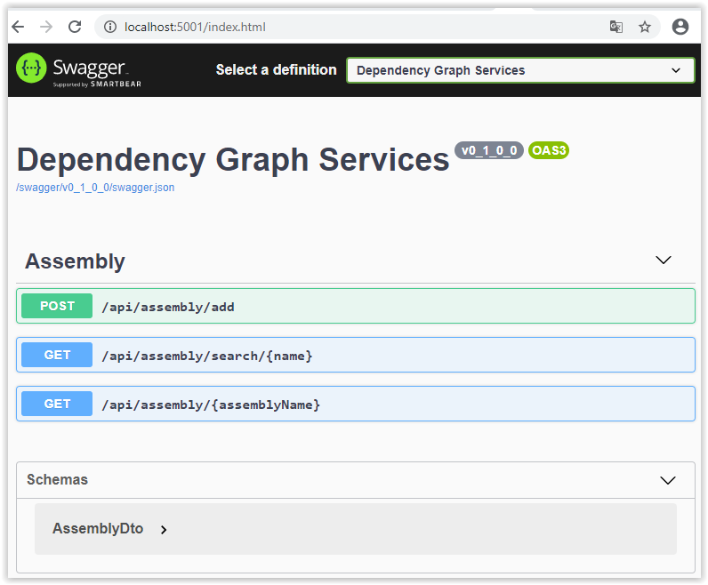
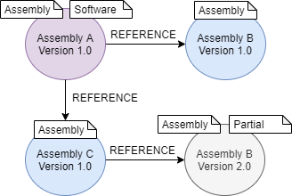

# Dependencies Graph Services

[](/LICENSE)
[![.NET Core][github-actions-badge]][github-actions]
[![Quality Gate Status][sonar-badge]][sonar-url]

Dependencies Graph Services provides Apis to store and retrieve assemblies and these dependencies. behind service, a [Neo4j][neo4j-url] database ensures graph storage.

Analyse can be realized with Dependencies Viewer and sending to Dependencies Graph with a specific export plugin.

## Linked repositories
|        Project                         |                Build State                              | 
| -------------------------------------- | :-----------------------------------------------------: | 
| [**Dependencies Viewer**][viewer-url]  |      [![Build][viewer-badge]][viewer-url]               | 
| [**Export plugins**][exchange-url]       |      [![Build][exchange-badge]][exchange-url]   | 


## Features

### Functional features:

* Import Assembly definitions
* Retrieve assemblies
* Managed partial assembly (assembly not found during analysis)
* Managed Software (assembly with a main method)
* Authentication with keycloak

### Technical features:

* Transactions
* Swagger to view REST APIs
* Docker

### Docker container 

This image is base on **Linux**. 

You can configure container by setting environment variables.

|   Configuration file         | Environment variable  |          Comment           |   default value     | Exemple |
| -----------------------------|---------------------- | :--------------------------|-------------------- |---------|
| ForceHttpsRedirection        | ForceHttpsRedirection | Activate https redirection | false               |         |
| GraphConfig.Uri              | GraphConfig__Uri      | Uri for neo4j connection   | bolt://localhost    |         |
| GraphConfig.User             | GraphConfig__User     | neo4j user                 |                     |         |
| GraphConfig.Password         | GraphConfig__Password | neo4j user password        |                     |         |
| Security.Enabled             | Security__Enabled     | Activate Authentication    | false               |         |
| Security.Oidc.ClientId       | Security__Oidc__ClientId  | ClientId to validate token   |  graph-rest   |         |
| Security.Oidc.Authority      | Security__Oidc__Authority  | Authority to validate token   |             |         |
| Security.Swagger.ClientId    | Security__Swagger__ClientId  | ClientId to logon from swagger (default value)  |        |         |
| Security.Swagger.ClientSecret| Security__Swagger__ClientSecret  | ClientSecret to logon from swagger (default value) |  |         |
| Security.RoleMappings        | Security__RoleMappings  | Map keyclaok rights to application rights   |  | [ { \"Server\": \"read-serve\", \"App\": \"read\" } ] |

Like all asp.net code applications, you can [customize host configuration][host-configuration-ms].

#### Roles:

|        Name        |       Secured routes      |
| -------------------|------------------------- |
| read               | /api/assembly/search, /api/assembly |
| write              | /api/assembly/add       |

#### Volumes exposed by container:

|        Name        |       Description        |
| -------------------|------------------------- |
| logs               | Log files location       |

#### Ports exposed by Container:

|        Name        |       Description        |
| -------------------|------------------------- |
| 80                 | HTTP port for web site   |
| 443                | HTTPS port for web site  |

You can start a Dependencies Graph Service container like this:

```
docker run \
    --publish=5001:80 \
    dependencies-graph-api:tag
```
When service is running, you can go to swagger page pour explore services



If you need force https on service, you can use the following command sample:

```
docker run \
     --publish 5000:80 \
     --publish 5001:443 \
     --env ForceHttpsRedirection=true \
     --env ASPNETCORE_URLS="http://+:80;https://+:443" \
     --env ASPNETCORE_HTTPS_PORT=5001 \
     --env ASPNETCORE_Kestrel__Certificates__Default__Password="<certificate-password>" \
     --env ASPNETCORE_Kestrel__Certificates__Default__Path=/https/<certificate-name> \ 
     --volume <certificate-path>:/https/ \
     dependencies-graph-api:tag
```

## Development

This project has tooling for Visual Studio and Visual Studio Code.

### Visual Studio Code

The project is configured to work with the [Remote Development][remote-development-plugin-url] plugin. With VS Code, you can open the workspace directory in a container (from mcr.microsoft.com/dotnet/core/sdk:3.1) and work inside.

VS Code launch Two containers when you open workplace
* Development container
* neo4j Container

Some plugins are automatically installed on VS Code for the development session. Now plugins added are:
* C# (ms-dotnettools.csharp)
* Debugger for Chrome (msjsdiag.debugger-for-chrome)

You can run application with following code (in VS Code Terminal):

```
/workspace# dotnet restore
/workspace# dotnet run --project Dependencies.Graph.Api/Dependencies.Graph.Api.csproj
```

After build, you can open a navigator in your local computer and navigate to
```
http://localhost:5000
```

### Visual Studio 

The solution contains a docker-compose project to run from visual studio:
* Container with the software compiled for the container (Linux)
* neo4j container

To start a debugging session, define docker-compose project as the startup project for the solution and start Visual Studio debugger. A navigator should be launch with the application start page.

## Database schema

In a graph database, the schema is defined by node (and labels associated) and relations between nodes

### Node

For this project we have one node for a specif version of assembly. The assembly full name (ex: *Dependencies.Viewer.App, Version=1.0.0.0, Culture=neutral, PublicKeyToken=null*) is used as node unique key.

### Relation

* Reference: represents a reference between two assemblies

### Labels

* Assembly: represents an assembly version (assembly full name is used as a key)
* Software: Additional label for assembly with a main method
* Partial: an additional label for assembly not found during dependencies analyses (missing assembly or another version is used when program use assembly)



[github-actions]:                   https://github.com/xclemence/Dependencies-graph-services/actions
[github-actions-badge]:             https://github.com/xclemence/Dependencies-graph-services/workflows/Master/badge.svg?branch=master
[github-package]:                   https://github.com/xclemence/dependencies-graph-services/packages

[sonar-badge]:                      https://sonarcloud.io/api/project_badges/measure?project=xclemence_dependencies-graph-services&metric=alert_status
[sonar-url]:                        https://sonarcloud.io/dashboard?id=xclemence_dependencies-graph-services

[viewer-badge]:                     https://github.com/xclemence/Dependencies.Viewer/workflows/Ms%20Build/badge.svg
[viewer-url]:                       https://github.com/xclemence/Dependencies.Viewer

[exchange-badge]:                   https://github.com/xclemence/Dependencies.Exchange/workflows/WPF%20.NET%20Core/badge.svg?branch=master
[exchange-url]:                     https://github.com/xclemence/Dependencies.Exchange

[neo4j-url]:                        https://neo4j.com/
[remote-development-plugin-url]:    https://marketplace.visualstudio.com/items?itemName=ms-vscode-remote.vscode-remote-extensionpack 
[host-configuration-ms]:            https://docs.microsoft.com/en-us/aspnet/core/fundamentals/host/generic-host?view=aspnetcore-3.1#host-configuration


